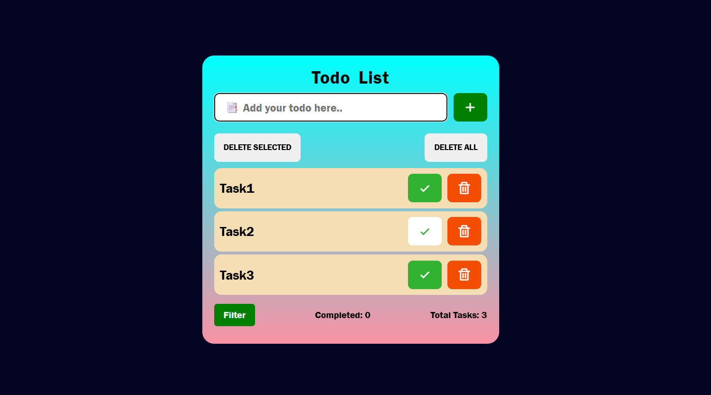

# 📝 TO-DO LIST  
A simple and responsive To-Do List application built using HTML5, CSS3, and JavaScript.

---

## 📌 About the Project
This is a beginner-friendly To-Do List web application designed to help users manage their daily tasks efficiently.

---

---

## ✨ Features
- ➕ Add new tasks  
- ✔️ Mark tasks as completed  
- 🗑️ Delete tasks  
- 🔍 Filter tasks (All / Completed / Pending)  
- 💾 Saves tasks in Local Storage (if implemented)  
- 📱 Fully responsive UI  

---

## 🛠️ Technologies Used
- **HTML5** – Page structure  
- **CSS3** – Styling & layout  
- **JavaScript (Vanilla JS)** – Logic & interactivity  

---

🔗 **Live Demo:** *https://abhisheksrivastava-009.github.io/Codveda-Todo-list/*

---

<!-- ABOUT THIS PROJECT-:

  1. In this project i have created a simple to-do app using HTML CSS and JavaScript.
  2. Built a To-Do List application to make a list of daily works written down in one place.
  3. Implemented functionalities like add task, remove task, filter tasks and also mark tasks as done. -->
 